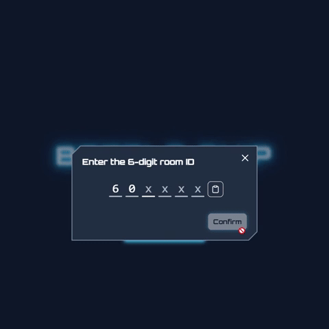
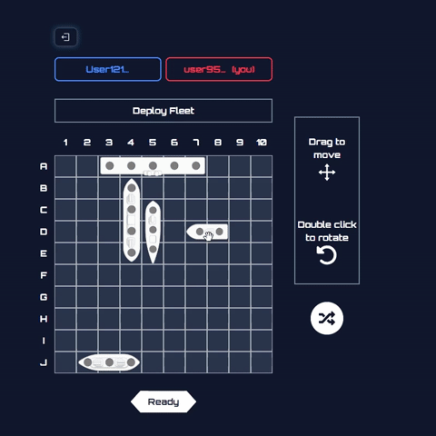
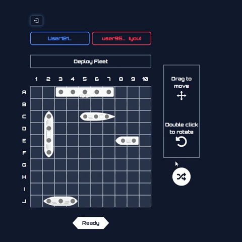
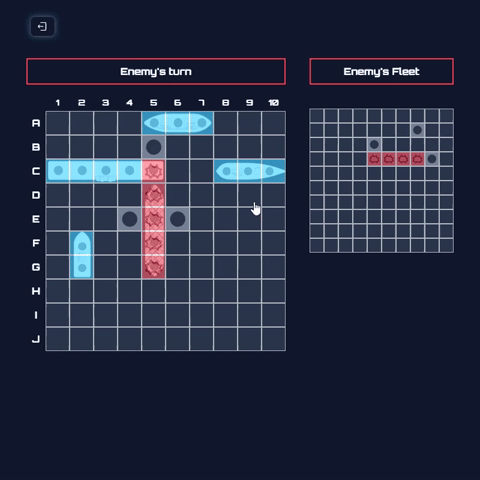
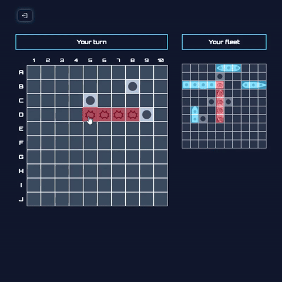

# Battleship Realtime Game

A realtime multiplayer Battleship game built with **React**, **TypeScript**, **Socket.IO**, and **Node.js**. This project is structured with both **frontend** and **backend** directories, enabling a fully realtime game experience in the browser.

---

## Table of Contents

- [Demo](#demo)
- [Features](#features)
- [Technologies](#technologies)
- [Frontend](#frontend)
- [Backend](#backend)
- [Getting Started](#getting-started)
- [Folder Structure](#folder-structure)
- [Contributing](#contributing)
- [License](#license)

---

## 🎮 Demo

<!-- Dưới đây là một số ảnh và GIF minh họa các tính năng chính của **Battleship Realtime Game**.   -->

---

### 1. Tham gia phòng chơi

> Người chơi có thể nhập Room ID để tham gia trận đấu hoặc tạo phòng mới.

---

### 2. Bố trí tàu

> Kéo thả các tàu vào vị trí mong muốn trên bản đồ trước khi bắt đầu trận đấu.

---

### 3. Bố trí tàu ngẫu nhiên

> Hoặc sử dụng tính năng đặt tàu ngẫu nhiên để tiết kiệm thời gian.

---

### 4. Đối thủ bắn trượt

> Hiển thị thông báo khi đối thủ bắn trượt tàu của bạn.

---

### 5. Người chơi bắn trúng, tàu bị đánh chìm, bắn trượt

> Tương tác trực tiếp trong trận đấu: bắn trúng, chìm tàu, và các lượt bắn trượt được cập nhật realtime.

---

## Features

- Realtime multiplayer Battleship gameplay.
- Create and join game rooms with unique room IDs.
- Player setup and name customization.
- Fully responsive UI for desktop and mobile.
- Dark and light theme support.
- Localization support (English & Vietnamese).
- Notifications for game events (player join/leave, hits, misses).

---

## Technologies

**Frontend:**

- React 19
- TypeScript
- Vite
- TailwindCSS
- Framer Motion
- React Router Dom
- Socket.IO Client
- UUID for unique player IDs
- react-tsparticles for visual effects
- @dnd-kit for drag-and-drop functionality

**Backend:**

- Node.js with TypeScript
- Express.js
- Socket.IO
- dotenv for environment variables

---

## Frontend

The frontend of this Battleship Realtime Game is a **React** application built with **TypeScript** and **Vite**, designed to provide a responsive, interactive, and realtime multiplayer experience. It communicates with the backend using **Socket.IO** and manages all client-side game logic, UI, and user interactions.

### Key Features

1. **Routing & Protected Routes**
   - Uses `react-router-dom` for client-side routing.
   - Pages: `HomePage`, `RoomPage`, `SetupPage`, `GamePage`, `NotFoundPage`.
   - Protected routes implemented using the custom hook `useAuth` to ensure only authorized players can access game rooms and gameplay pages.
   - Lazy loading with `React.lazy` and `Suspense` for room and game pages to optimize performance.

2. **Theme & Localization**
   - Supports **dark** and **light** themes through `AppSettingsContext`.
   - Language support for **English** and **Vietnamese**, using a `t` function for translating UI text dynamically.
   - Player theme and language preferences are persisted in `localStorage`.

3. **Game State Management**
   - `GameContext` manages the room, game, player states, and player-specific information.
   - Handles joining/leaving rooms, real-time updates, and syncing game state with the backend.
   - Uses `useSocket` hook to listen to Socket.IO events such as `roomUpdate` and `playerStateUpdate`.

4. **UI Components**
   - Modular React components for building the game interface, including:
     - `BoardBattle` and `BoardSetup` for the game grid.
     - `Cell` and `Ship` for individual board cells and ship pieces.
     - `Modal` components for room creation, joining, settings, and confirmation.
     - `Notifycation` system for in-app notifications (hits, misses, player join/leave).
   - HOC `WithLoading` for handling component-level loading states.
   - Framer Motion animations for smooth UI transitions and interactive feedback.

5. **Player Management**
   - Automatic UUID generation for each player stored in `localStorage`.
   - Persistent player name with fallback to random default names if not set.
   - Player information synchronized across sessions and rooms.

6. **Assets & Styling**
   - Ship images stored in `/public/images/ships`.
   - TailwindCSS for responsive design and quick styling.
   - Global styles defined in `App.css` and `index.css`.

7. **Hooks & Utilities**
   - `useAuth` – protect routes and manage access control.
   - `usePlayerChangeNotify` – notify players when someone joins or leaves the room.
   - `useSocket` – manage all Socket.IO client events and communication.
   - Utility functions for game mechanics, ship positioning, and board management.

8. **Project Structure**
   - **Components**: UI components, modals, game entities, and HOCs.
   - **Context**: `AppSettings`, `GameContext`, `NotifycationContext`.
   - **Hooks**: `useAuth`, `useSocket`, `usePlayerChangeNotify`.
   - **Pages**: All top-level pages (Home, Room, Setup, Game, NotFound).
   - **Services**: `gameSocketService.ts` for managing socket interactions.
   - **Data & Types**: Ship data and TypeScript types for strong typing.

### Running Frontend

cd clients  
npm install  
npm run dev  

The frontend will start on `http://localhost:5173` (or the port provided by Vite). You can access the home page, create or join a room, and play Battleship in realtime.

## Backend

The backend is a **Node.js** server written in **TypeScript** using **Express** and **Socket.IO** to handle realtime game communication. It manages rooms, players, and game state entirely in memory, allowing players to join, set up their boards, and play battleship in realtime.

### Key Features

1. **Room Management**
   - Create and join rooms with unique room IDs.
   - Track connected players and handle player disconnects.

2. **Game State Management**
   - Maintain in-memory game state for each room.
   - Update player actions (hits, misses, ship placement) in realtime.
   - Broadcast updates to all connected players using Socket.IO.

3. **API & Socket Events**
   - `getRoom` – fetch current room state.
   - `roomUpdate` – notify clients of room changes.
   - `playerStateUpdate` – notify clients of individual player state changes.
   - Easy to extend with additional game logic or persistence.

4. **Environment Configuration**
   - Use `.env` file for server settings such as port numbers or API keys.

### Running Backend

cd server
npm install
npm run dev

The server will start in **development mode** with automatic reload using `ts-node-dev`. In production, you can build and run the compiled JavaScript:

npm run build
npm start

